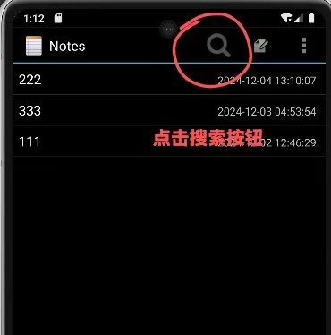
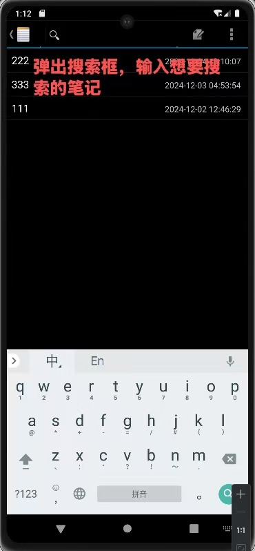
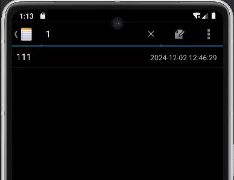
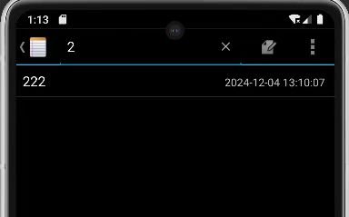
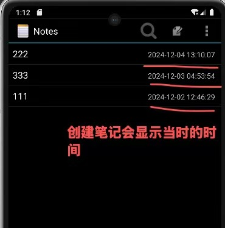
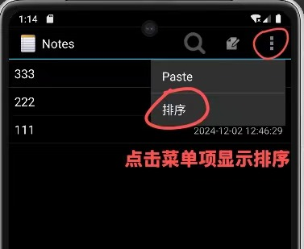
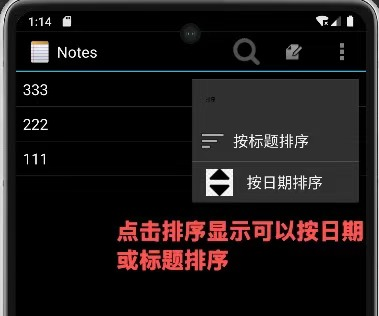
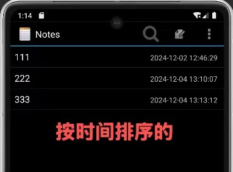
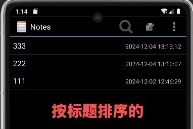
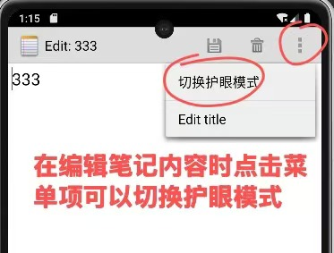

NotePad 是一个为 Android 平台设计的笔记应用程序，旨在提供一个简洁、高效的用户界面，使用户能够轻松地管理个人笔记。该应用
利用 Android Studio 开发，支持创建、编辑、查看和删除笔记等基本功能，同时提供排序、护眼模式等扩展功能。

功能概述

基本功能
创建笔记：用户可以通过点击“新建笔记”按钮快速创建新笔记。
编辑笔记：支持对笔记内容和标题的编辑。
查看笔记：通过笔记列表视图，用户可以浏览所有笔记。
删除笔记：长按笔记项，选择删除选项，可以移除不需要的笔记。
搜索笔记：点击搜索菜单，可以根据笔记内容搜索笔记。
    
    // 找到搜索菜单项并设置其监听器
    MenuItem searchItem = menu.findItem(R.id.menu_search);
    SearchView searchView = (SearchView) searchItem.getActionView();
    searchView.setOnQueryTextListener(new SearchView.OnQueryTextListener() {
    @Override
    public boolean onQueryTextSubmit(String query) {
    // 处理搜索提交事件
    return false;
    }

            @Override
            public boolean onQueryTextChange(String newText) {
                // 处理搜索文本变化事件
                filterNotesList(newText);
                return false;
            }
        });
    private void searchNotes(String query) {
    // 调用 filterNotesList 来实现搜索逻辑
    filterNotesList(query);
    }

    private void filterNotesList(String query) {
        // 根据查询过滤笔记列表
        if (mCursor != null) {
            mCursor.close();
            mCursor = null;
        }
        String selection = NotePad.Notes.COLUMN_NAME_TITLE + " LIKE ? OR " + NotePad.Notes.COLUMN_NAME_NOTE + " LIKE ?";
        String[] selectionArgs = {"%" + query + "%", "%" + query + "%"};
        mCursor = getContentResolver().query(NotePad.Notes.CONTENT_URI, PROJECTION, selection, selectionArgs, null);
        ((SimpleCursorAdapter) getListAdapter()).changeCursor(mCursor);
    }

每个笔记的创建时间戳：创建笔记后会显示时间戳。

    @Override
    public void bindView(View view, Context context, Cursor cursor) {
    TextView titleView = (TextView) view.findViewById(R.id.note_title);
    TextView timestampView = (TextView) view.findViewById(R.id.note_timestamp);
    if (titleView == null || timestampView == null) {
    Log.e(TAG, "Error: One of the TextViews is null");
    return; // 退出方法，如果任一TextView为null
    }

    String title = cursor.getString(COLUMN_INDEX_TITLE);
    long timestamp = cursor.getLong(COLUMN_INDEX_MODIFIED);
    // 确保时间戳是毫秒级单位，如果是秒级单位则不需要乘以1000L
    String formattedDate = new SimpleDateFormat("yyyy-MM-dd HH:mm:ss",
            Locale.getDefault()).format(new Date(timestamp));

            titleView.setText(title);
            timestampView.setText(formattedDate);
        }
    };

扩展功能
笔记排序：用户可以根据笔记的标题或修改日期进行排序。

    @Override
    public boolean onCreateOptionsMenu(Menu menu) {
    super.onCreateOptionsMenu(menu);
    MenuInflater inflater = getMenuInflater();
    inflater.inflate(R.menu.list_options_menu, menu);

        // 添加排序选项到菜单
        MenuItem sortItem = menu.findItem(R.id.menu_sort);
        SubMenu sortSubMenu = sortItem.getSubMenu();
        sortSubMenu.clear(); // 清除默认子菜单项

        // 添加按标题排序的菜单项
        sortSubMenu.add(0, R.id.sort_by_title, 0, R.string.sort_by_title)
                .setIcon(android.R.drawable.ic_menu_sort_by_size)
                .setOnMenuItemClickListener(new MenuItem.OnMenuItemClickListener() {
                    @Override
                    public boolean onMenuItemClick(MenuItem item) {
                        sortNotesByTitle();
                        return true;
                    }
                });

        sortSubMenu.add(0, R.id.sort_by_date, 0, R.string.sort_by_date)
                .setIcon(R.drawable.ic_menu_sort_by_date) // 确保你的 drawable 文件存在
                .setOnMenuItemClickListener(new MenuItem.OnMenuItemClickListener() {
                    @Override
                    public boolean onMenuItemClick(MenuItem item) {
                        sortNotesByDate();
                        return true;
                    }
                });
    private void sortNotesByTitle() {
    // 实现按标题排序的逻辑
    String newSortOrder = NotePad.Notes.COLUMN_NAME_TITLE + " ASC"; // 按标题升序排序
    applySortOrder(newSortOrder);
    }

    private void sortNotesByDate() {
        // 实现按日期排序的逻辑
        String newSortOrder = NotePad.Notes.COLUMN_NAME_MODIFICATION_DATE + " DESC"; // 按修改日期降序排序
        applySortOrder(newSortOrder);
    }

    private void applySortOrder(String newSortOrder) {
        // 保存新的排序顺序
        sortOrder = newSortOrder;
        // 重新加载笔记列表
        refreshNotesList();
        // 保存排序偏好
        saveSortPreference(sortOrder);
    }

    private void refreshNotesList() {
        // 重新查询数据并更新列表
        Cursor newCursor = managedQuery(getIntent().getData(), PROJECTION, null, null, sortOrder);
        ((SimpleCursorAdapter) getListAdapter()).changeCursor(newCursor);
    }

    private void saveSortPreference(String sortOrder) {
        SharedPreferences preferences = getSharedPreferences("NotePadPrefs", MODE_PRIVATE);
        SharedPreferences.Editor editor = preferences.edit();
        editor.putString("SortOrder", sortOrder);
        editor.apply();
    }

护眼模式：开启护眼模式，减少屏幕蓝光，保护视力。（只有菜单按钮，并未完全实现这个功能）

快速访问菜单：通过菜单按钮，用户可以快速访问保存、撤销、复制和粘贴等操作。

技术实现

核心组件
NoteEditor.java：处理笔记的编辑和创建逻辑。
NotesList.java：管理笔记列表的显示和用户交互。
NotePadProvider.java：作为内容提供者，负责笔记数据的存储和检索。
NotesLiveFolder.java：创建实时文件夹，用于在主屏幕上显示笔记动态视图。
TitleEditor.java：允许用户编辑笔记的标题。

用户界面
note_editor.xml：笔记编辑器的布局文件，包含自定义的 LinedEditText 用于显示和编辑笔记内容。
noteslist_item.xml：笔记列表中每个笔记项的布局。
title_editor.xml：标题编辑器的布局，包含一个 EditText 用于编辑笔记标题。

菜单资源
editor_options_menu.xml：编辑器中的选项菜单，包含保存、撤销、删除和护眼模式切换选项。
list_context_menu.xml：笔记列表的上下文菜单，包含打开、复制和删除选项。
list_options_menu.xml：笔记列表的选项菜单，包含添加新笔记和排序选项。

字符串资源
strings.xml：包含应用中使用的字符串资源，如菜单项、标题、错误消息等。